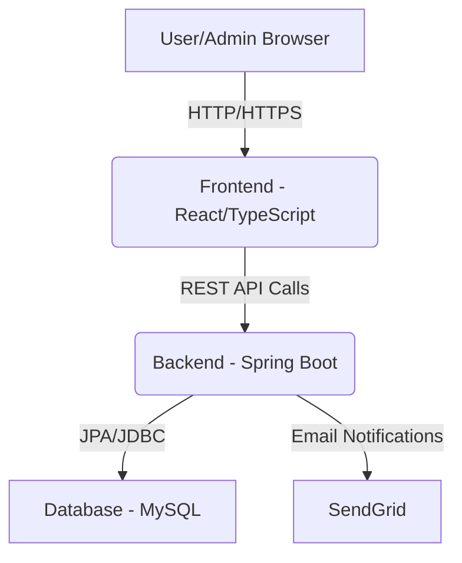

# 🐾 Zoo Management System 🌿

## ✨ Project Overview

Welcome to the **Zoo Management System**! This project implements a **RESTful API** designed to manage comprehensive information for a modern zoo. It allows for the creation, reading, updating, and deletion of data across several key entities, along with advanced filtering capabilities and essential business rules. The system also includes a public-facing website for visitors and a robust administrative panel for staff, built with Spring Boot for the backend and React with TypeScript for the frontend.

🔗 **Live Demo:** [https://zoo-front-production.up.railway.app/](https://zoo-front-production.up.railway.app/)

## 🚀 Features

This system provides a comprehensive RESTful API to manage zoo operations, fulfilling the following core requirements:

### 🐘 Entities & CRUD Operations

The API manages the following 5 core entities, each supporting full **CRUD (Create, Read, Update, Delete)** operations:

1.  **Animal:**
    *   Attributes: `id`, `nome`, `espécie`, `idade`, `habitat` (reference to Habitat), `cuidador responsável` (reference to Cuidador).
    *   Operations: Create, List, Update, Delete animals.
2.  **Habitat:**
    *   Attributes: `id`, `nome` (e.g., Savana, Floresta, Aquário, Terrário), `tipo` (e.g., terrestre, aquático, aéreo), `capacidade máxima de animais`.
    *   Operations: Create, List, Update, Delete habitats.
3.  **Cuidador (Caretaker):**
    *   Attributes: `id`, `nome`, `especialidade` (e.g., mamíferos, répteis, aves), `turno de trabalho`.
    *   Operations: Create, List, Update, Delete caretakers.
4.  **Veterinário (Veterinarian):**
    *   Attributes: `id`, `nome`, `CRMV`, `especialidade` (e.g., felinos, aves exóticas).
    *   Operations: Create, List, Update, Delete veterinarians.
5.  **Alimentação (Feeding Plan):**
    *   Attributes: `id`, `tipo de comida` (e.g., carne, frutas, ração especial), `quantidade diária`, `animal` (reference to Animal).
    *   Operations: Create, List, Update, Delete feeding plans.

### 🔍 Query Endpoints with Filters

The API provides specific endpoints for querying information with filters:

*   **Animal:**
    *   Search by `espécie` (e.g., `GET /animais?especie=Leão`).
    *   Search by `idade mínima/máxima` (e.g., `GET /animais?idadeMin=5&idadeMax=10`).
    *   Search by `nome parcial`.
*   **Habitat:**
    *   Search by `tipo` (e.g., `GET /habitats?tipo=terrestre`).
*   **Cuidador:**
    *   Search by `especialidade`.
    *   Search by `turno de trabalho`.
*   **Veterinário:**
    *   Search by `especialidade`.
*   **Alimentação:**
    *   Search by `tipo de comida`.
    *   Search by `animal` (by `animalId`, e.g., `GET /alimentacoes?animalId=3`).

### 📧 Email Notification Feature

The system includes an automated email notification feature for caretakers (cuidadores) when animals are assigned, updated, or deleted, ensuring timely communication regarding their responsibilities.

### 🌐 Frontend (User & Admin Interface)

*   **Public Site:**
    *   🖼️ Dynamic Home Page with Hero Carousel.
    *   🦁 Animal Gallery showcasing detailed information about residents.
    *   🗺️ Visit Information (map, opening hours) and Contact Form.
*   **Management Dashboard (Admin Panel):**
    *   📊 Overview Dashboard with statistics and alerts.
    *   Intuitive Navigation with tabs and breadcrumbs.
    *   Reusable components for consistent UX (modals, notifications).

## ⚖️ Business Rules

The system enforces the following mandatory business rules:

*   **Habitat Capacity:** A habitat cannot exceed its maximum capacity of animals.
*   **Caretaker Association:** Each animal must have at least one caretaker associated.

## 🛠️ Technologies Used

### Frontend

*   **React:** Building dynamic and interactive user interfaces.
*   **TypeScript:** Enhanced code quality, readability, and maintainability.
*   **Vite:** Lightning-fast development experience and optimized builds.
*   **HTML/CSS:** Standard web technologies for structure and styling.
*   **Axios:** Promise-based HTTP client for API communication.

### Backend

*   **Spring Boot:** Rapid development of robust, stand-alone applications.
*   **Maven:** Dependency management and build automation.
*   **MySQL:** Reliable relational database for data persistence.
*   **Spring Data JPA:** Simplified data access layer.
*   **Lombok:** Reduced boilerplate code.
*   **SendGrid:** Email service for notifications.
*   **SpringDoc OpenAPI:** Automated API documentation.
*   **Testcontainers:** For integration testing with real services (e.g., MySQL).

## 🏗️ Architecture

The system follows a client-server architecture:

*   **Frontend:** A React application that consumes RESTful APIs provided by the backend.
*   **Backend:** A Spring Boot application that exposes RESTful APIs, handles business logic, interacts with the MySQL database, and sends email notifications.
*   **Database:** MySQL for persistent storage of all zoo-related data.



## 🚀 Getting Started (Local Development)

To set up and run the project locally, follow these steps:

### Prerequisites

*   Java 17 or higher
*   Node.js (LTS version) & npm/yarn
*   Maven
*   MySQL Server
*   Git

### 1. Clone the Repository

```bash
git clone <repository-url>
cd zoo
```

### 2. Backend Setup

Navigate to the backend directory:

```bash
cd backend/santuario
```

*   **Database Configuration:**
    *   Create a MySQL database (e.g., `zoo_db`).
    *   Update `src/main/resources/application.properties` with your MySQL connection details (username, password, database name).
    *   Ensure `spring.jpa.hibernate.ddl-auto` is set to `update` or `create` for initial schema generation (change to `validate` or `none` for production).
*   **Email Service Configuration:**
    *   Obtain a SendGrid API Key.
    *   Set `SENDGRID_API_KEY` and `SENDGRID_FROM_EMAIL` in your environment variables or `application.properties`.
*   **Build and Run:**

```bash
mvn clean install
mvn spring-boot:run
```

The backend API will be accessible at `http://localhost:8080` (or your configured port).

### 3. Frontend Setup

Navigate to the frontend directory:

```bash
cd ../../frontend
```

*   **Install Dependencies:**

```bash
npm install
# or yarn install
```

*   **Run the Development Server:**

```bash
npm run dev
# or yarn dev
```

The frontend application will be accessible at `http://localhost:5173` (or your configured Vite port).

### 4. Running Tests

To run the backend integration and unit tests:

*   **Prerequisite:** Ensure **Docker is running** on your machine, as integration tests use Testcontainers to spin up a real MySQL database.
*   Navigate to the backend directory:

```bash
cd backend/santuario
```

*   **Execute Tests:**

```bash
./mvnw test
```
(On Windows, use `mvnw.cmd test`)

*   **Interpreting Results:** Look for `[INFO] BUILD SUCCESS` at the end of the output. If `[INFO] BUILD FAILURE` occurs, check the `Failures` and `Errors` counts in the test summary for details.

## 📧 Email Notification Walkthrough

This system includes an email notification feature for caretakers (cuidadores) when animals are assigned, updated, or deleted. Follow these steps to test it:

1.  **Ensure Backend Email Configuration:**
    *   Make sure your backend is configured with a valid SendGrid API Key and `SENDGRID_FROM_EMAIL` as described in the "Backend Setup" section.

2.  **Create a Caretaker (Cuidador) with a Valid Email:**
    *   Access the frontend application (e.g., `http://localhost:5173`).
    *   Navigate to the "Caretakers" management section.
    *   Create a new caretaker and **provide a valid email address** that you have access to (e.g., your personal email).

3.  **Trigger an Email Notification:**
    *   **Create an Animal:** Go to the "Animals" management section and create a new animal. When prompted, assign this animal to the caretaker you just created.
    *   **Update an Animal:** Edit an existing animal and change its assigned caretaker to the one you created, or update other details of an animal already assigned to that caretaker.
    *   **Delete an Animal:** Delete an animal that is currently assigned to the caretaker you created.

4.  **Check Your Email:**
    *   After performing one of the actions above, check the inbox of the email address you provided for the caretaker.
    *   **Important:** The email might land in your **spam or junk folder**, so be sure to check there as well.

## 📚 Documentation

For more detailed information on each part of the system, refer to the dedicated documentation files:

*   **[Backend Documentation](./backend/santuario/backend_documentation.md)**
*   **[Frontend Documentation](./frontend/frontend_documentation.md)**
